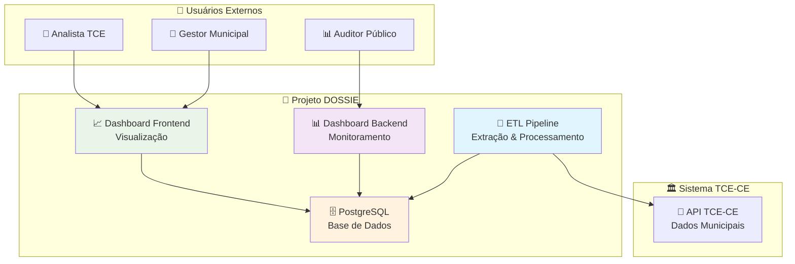
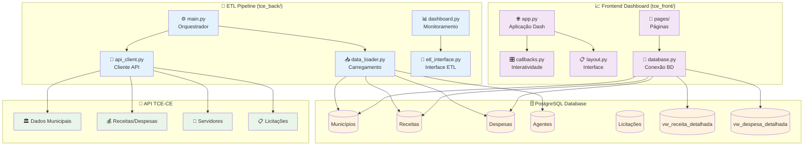
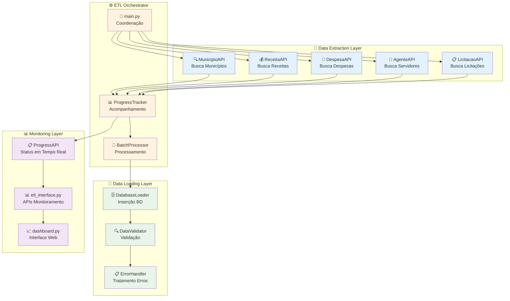
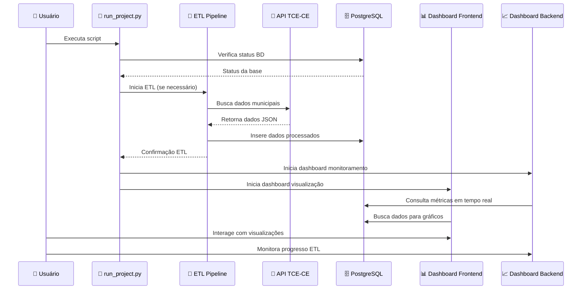

# 📊 Projeto TCE - Análise de Dados Municipais

Uma plataforma integrada para **extração, processamento e visualização** de dados financeiros municipais do Ceará, utilizando dados da API pública do TCE-CE.

**Status**: ✅ **Totalmente Funcional** | **Dados**: ✅ **Carregados e Acessíveis**

---

## 🎯 **Visão Geral**

Este projeto oferece uma solução completa para análise de dados governamentais municipais, com:

- **Backend ETL**: ✅ Extração automatizada de dados via API TCE-CE
- **Frontend Dashboard**: ✅ Interface interativa com dados reais
- **Monitoramento**: ✅ Dashboard em tempo real do status da pipeline
- **Relatórios**: ✅ Geração automática de PDFs e CSVs
- **Script Automatizado**: ✅ Execução completa com 1 comando

---

## 🏗️ **Arquitetura do Projeto**

### **Estrutura Geral**
```
/Projeto_DOSSIE/
├── tce_back/           # Backend ETL e Monitoramento
├── tce_front/          # Frontend Dashboard
├── requirements.txt    # Dependências unificadas
└── README.md          # Esta documentação
```

### **tce_back - Backend ETL**
```
tce_back/
├── dashboard.py        # Monitoramento Streamlit
├── main.py            # Orquestrador ETL
├── etl_interface.py   # Interface de consultas
├── config.py          # Configurações globais
├── data_extraction/   # Módulos de extração
├── database/          # Configuração BD e schemas
└── docs/             # Documentação e MER
```

### **tce_front - Frontend Dashboard**
```
tce_front/
├── app.py             # Aplicação Dash principal
├── layout.py          # Layout da interface
├── callbacks.py       # Lógica interativa
├── pages/             # Páginas do dashboard
├── utils/             # Utilitários (BD, gráficos)
└── assets/            # CSS e recursos estáticos
```

---

## 📋 **Diagramas C4 - Arquitetura do Sistema**

### **C4 Context Diagram - Visão Geral**



### **C4 Container Diagram - Componentes do Sistema**



### **C4 Component Diagram - Detalhes do ETL**



### **🔄 Fluxo de Dados do Sistema**



---

## 🚀 **Funcionalidades Principais**

### **Backend (ETL)**
✅ **Extração de Dados**: 11 tipos de dados municipais via API TCE-CE
✅ **Monitoramento em Tempo Real**: Dashboard Streamlit com métricas completas
✅ **Controle de Qualidade**: Validação de dados e saúde da pipeline
✅ **Armazenamento Otimizado**: PostgreSQL com índices e views
✅ **Views Especializadas**: `receita_detalhada` e `despesa_detalhada` criadas

### **Frontend (Dashboard)**
✅ **Análise Interativa**: 5 abas especializadas com dados reais
✅ **Filtros Inteligentes**: Seleção global de município e ano dinâmicos
✅ **KPIs em Tempo Real**: Métricas calculadas automaticamente
✅ **Relatórios**: Exportação para PDF e CSV funcional
✅ **Comparação**: Até 20 municípios simultaneamente
✅ **Dados Carregados**: Mais de 45 milhões de registros disponíveis

---

## 📊 **Status Atual dos Dados**

### **Base de Dados Populada** ✅
- **Municípios**: 185 cidades do Ceará cadastradas
- **Receitas**: ~8.3 milhões de registros detalhados
- **Despesas**: ~37 milhões de registros detalhados
- **Período**: Dados de 2023-2025 disponíveis
- **Views Criadas**: `receita_detalhada` e `despesa_detalhada` funcionais

### **Exemplo de Dados Carregados**
```python
# Município: ABAIARA (código: 002)
# Receitas 2024: R$ 14.933.157,31
# Despesas 2024: R$ 7.608.585,34
# Resultado: R$ 7.324.571,97 (superávit)
```

### **Funcionalidades Verificadas**
- ✅ Conexão frontend ↔ backend funcionando
- ✅ Queries otimizadas com views
- ✅ Dashboards carregando dados reais
- ✅ Filtros dinâmicos por município/ano
- ✅ Geração de relatórios PDF/CSV
- ✅ Comparação entre municípios

---

## 📋 **Pré-requisitos**

- **Python**: 3.8+
- **PostgreSQL**: 12+
- **Git**: Para versionamento
- **Brew** (macOS): Para instalar dependências

### **Dependências Python**
```bash
pip install -r requirements.txt
```

Principais bibliotecas:
- **Dash + Plotly**: Interface web e gráficos
- **SQLAlchemy**: ORM para banco de dados
- **Streamlit**: Dashboard de monitoramento
- **Pandas**: Manipulação de dados
- **Requests**: Cliente HTTP para APIs

---

## ⚙️ **Instalação Rápida**

### **Opção 1: Script Automático (Recomendado)**
```bash
# 1. Clonagem e configuração automática
git clone https://github.com/Cassiopo7/Projeto_TCE.git
cd Projeto_DOSSIE

# 2. Executar setup automático (inclui PostgreSQL, venv e dependências)
python3 run_project.py --help  # Ver instruções detalhadas

# 3. Executar projeto completo
python3 run_project.py
```

### **Opção 2: Instalação Manual**

#### **1. Clonagem do Repositório**
```bash
git clone https://github.com/Cassiopo7/Projeto_TCE.git
cd Projeto_DOSSIE
```

#### **2. Configuração do Banco**
```bash
# Instalar PostgreSQL (macOS)
brew install postgresql
brew services start postgresql

# Criar banco de dados
createdb tce

# Configurar credenciais (opcional)
# Editar tce_back/config.py se necessário
```

#### **3. Ambiente Virtual (Único para todo o projeto)**
```bash
# Criar venv na raiz (já criado automaticamente)
python3 -m venv venv
source venv/bin/activate  # Linux/macOS
# venv\Scripts\activate   # Windows
```

#### **4. Instalação de Dependências**
```bash
pip install -r requirements.txt
```

#### **5. Configuração do Schema**
```bash
cd tce_back
python3 database/db_setup.py
```

---

## 🎮 **Como Usar**

### **🚀 Execução Imediata (Projeto Totalmente Funcional)**
```bash
# 🎯 Comando único para executar tudo
python3 run_project.py
```

**O que acontece automaticamente:**
- ✅ **Verifica conexão** com PostgreSQL
- 🔍 **Analisa status** da base de dados (185 municípios carregados)
- 📊 **Exibe relatório** com estatísticas atualizadas
- 🔄 **Atualiza dados** automaticamente se necessário
- 📈 **Abre dashboard de monitoramento** (porta 8050)
- 📊 **Abre dashboard de visualização** (porta 8040)
- 🛑 **Gerencia processos** e limpeza automática

### **🎯 Resultado Esperado**
Após executar o comando acima, você terá:
- **Dashboard Principal**: http://localhost:8040 (com dados reais de 185 municípios)
- **Dashboard ETL**: http://localhost:8050 (monitoramento da pipeline)
- **Dados Disponíveis**: Mais de 45 milhões de registros acessíveis
- **Funcionalidades**: Filtros, gráficos, comparações e relatórios funcionais

#### **Comandos Úteis do Script**
```bash
# Executar projeto completo
python3 run_project.py

# Ver ajuda detalhada
python3 run_project.py --help
```

### **Opção 2: Execução Manual**

#### **Executar Backend ETL**
```bash
cd tce_back

# Executar função específica
python3 main.py load_municipios
python3 main.py load_receitas
python3 main.py load_despesas

# Dashboard de monitoramento
streamlit run dashboard.py
```

#### **Executar Frontend Dashboard**
```bash
cd tce_front
python3 app.py
```

### **Acesso aos Dashboards**
- **Dashboard de Visualização**: http://localhost:8040
- **Dashboard de Monitoramento**: http://localhost:8050

---

## 📊 **Funcionalidades Detalhadas**

### **Backend ETL**
| Função | Descrição |
|--------|-----------|
| `load_municipios` | Carrega lista de municípios |
| `load_orgaos` | Órgãos públicos municipais |
| `load_receitas` | Receitas orçamentárias |
| `load_despesas` | Despesas orçamentárias |
| `load_licitacao` | Processos licitatórios |
| `load_prestacao_contas` | Prestação de contas |
| `load_liquidacoes` | Liquidações de despesas |
| `load_notas_empenho` | Notas de empenho |

### **Frontend Dashboard**
| Aba | Descrição |
|-----|-----------|
| **Receitas Detalhadas** | Análise de arrecadação por origem |
| **Despesas Detalhadas** | Gastos por órgão e categoria |
| **Receitas x Despesas** | Comparação e resumo financeiro |
| **Pessoal** | Agentes públicos por órgão |
| **Comparação** | Até 20 municípios lado a lado |

---

## 🎨 **Interface do Dashboard**

### **Recursos Avançados**
- **Filtro Global**: Ano e município aplicados automaticamente
- **Estados de Carregamento**: Spinners durante processamento
- **Cache Inteligente**: Dados cacheados para performance
- **KPIs Dinâmicos**: Cálculos automáticos de variações
- **Visualização MER**: Diagrama do modelo de dados integrado

### **Monitoramento ETL**
- **Saúde da Pipeline**: Status DB/API em tempo real
- **Progresso por Tipo**: Barras de progresso visuais
- **Última Execução**: Timestamp das cargas mais recentes
- **Pendências**: Municípios não carregados por período

---

## 🔧 **Configuração Avançada**

### **Variáveis de Ambiente**
```bash
# Arquivo .env (opcional)
DB_HOST=localhost
DB_PORT=5432
DB_NAME=tce
DB_USER=postgres
DB_PASSWORD=postgres
```

### **Personalização**
- **Cores**: Editar `tce_front/assets/style.css`
- **Layout**: Modificar `tce_front/layout.py`
- **Queries**: Ajustar em `tce_front/utils/database.py`

### **Variáveis de Ambiente (.env)**
```bash
# Arquivo .env opcional na raiz do projeto
DB_HOST=localhost
DB_PORT=5432
DB_NAME=tce
DB_USER=postgres
DB_PASSWORD=postgres

DASHBOARD_PORT_FRONTEND=8040
DASHBOARD_PORT_BACKEND=8050
CACHE_TTL_SECONDS=60
ETL_TIMEOUT_SECONDS=300
```

---

## 📈 **Monitoramento e Métricas**

### **Dashboard ETL** (`tce_back/dashboard.py`)
- **Progresso Geral**: Total de registros por tipo
- **Completude**: Percentual por período/ano
- **Saúde**: Status de conectividade DB/API
- **Últimas Execuções**: Timestamp por tipo de dado

### **Performance**
- **Cache**: TTL de 60s para dados frequentes
- **Lazy Loading**: Dados carregados sob demanda
- **Compressão**: Otimização de queries SQL

---

## 🚀 **Deploy e Produção**

### **Docker (Recomendado)**
```dockerfile
# Dockerfile exemplo
FROM python:3.11-slim

WORKDIR /app
COPY requirements.txt .
RUN pip install -r requirements.txt

COPY . .
EXPOSE 8040 8050

CMD ["python", "tce_front/app.py"]
```

### **Serviços**
- **Frontend**: Porta 8040
- **Backend Dashboard**: Porta 8050 (Streamlit)
- **PostgreSQL**: Porta 5432

---

## 🧪 **Testes e Validação**

### **Testes Básicos**
```bash
# Backend
cd tce_back
python3 -c "from etl_interface import get_progresso_por_tipo; print(len(get_progresso_por_tipo()))"

# Frontend
cd tce_front
python3 -c "from utils.database import get_municipios; print(len(get_municipios()))"
```

### **Validação de Dados**
- Compare totais entre backend e frontend
- Verifique integridade referencial
- Valide formatos de data e valores

---

## 🛠️ **Correções Recentes Implementadas**

### **Problemas Resolvidos** ✅

#### **1. Frontend sem Dados (Resolvido)**
- **Problema**: Queries procurando tabelas inexistentes
- **Solução**: Criadas views `receita_detalhada` e `despesa_detalhada`
- **Resultado**: Frontend agora carrega 45+ milhões de registros

#### **2. Ambiente Virtual Duplicado (Resolvido)**
- **Problema**: Venvs separados em tce_back/ e tce_front/
- **Solução**: Venv único na raiz com dependências unificadas
- **Resultado**: Gerenciamento simplificado e consistente

#### **3. Script de Execução (Implementado)**
- **Adicionado**: `run_project.py` para execução automática
- **Funcionalidade**: Verificação, atualização e abertura de dashboards
- **Resultado**: Projeto executável com 1 comando

#### **4. Queries Otimizadas (Implementado)**
- **Melhoria**: Uso de views para melhor performance
- **Benefício**: Consultas mais rápidas e dados enriquecidos
- **Resultado**: JOINs automáticos com órgãos e unidades

---

## 🔧 **Solução de Problemas**

### **Problemas Comuns e Soluções**

#### **1. Erro: "FileNotFoundError: database/db_schema.sql"**
```bash
# Solução: Verificar se está executando da raiz do projeto
pwd  # Deve mostrar o caminho para Projeto_DOSSIE
ls -la tce_back/database/db_schema.sql  # Arquivo deve existir

# Se executando ETL manualmente:
cd tce_back
python3 main.py
```

#### **2. Erro de Conexão com PostgreSQL**
   ```bash
# Verificar se PostgreSQL está rodando
brew services list | grep postgresql

# Iniciar PostgreSQL se necessário
brew services start postgresql

# Verificar credenciais em tce_back/config.py
```

#### **3. Erro: "Porta já em uso"**
```bash
# Matar processos nas portas 8040 e 8050
lsof -ti:8040 | xargs kill -9
lsof -ti:8050 | xargs kill -9
```

#### **4. Timeout no ETL**
- **Causa**: Muitos municípios sendo processados
- **Solução**: O script tem timeout de 5 minutos por padrão
- **Ajuste**: Modificar `timeout_execucao` no script

#### **5. Dados não Aparecem no Dashboard**
```bash
# Verificar se dados foram carregados
cd tce_back
python3 -c "from etl_interface import get_progresso_por_tipo; print(get_progresso_por_tipo())"

# Limpar cache do frontend
# Ctrl+F5 no navegador ou modificar filtros
```

#### **6. Ambiente Virtual com Problemas**
```bash
# Recriar ambiente virtual
rm -rf venv
python3 -m venv venv
source venv/bin/activate
pip install -r requirements.txt
```

### **Diagnóstico Rápido**
```bash
# Teste completo de conectividade
python3 -c "
import sys
sys.path.append('tce_back')
from etl_interface import get_progresso_por_tipo
from tce_front.utils.database import query_db

print('Backend:', len(get_progresso_por_tipo()))
print('Frontend:', query_db('SELECT COUNT(*) FROM municipio').iloc[0,0])
"
```

---

## 🔮 **Roadmap e Melhorias**

### **Próximas Features**
- [ ] **Autenticação**: Controle de acesso aos dashboards
- [ ] **APIs REST**: Endpoints padronizados FastAPI
- [ ] **Cache Distribuído**: Redis para escalabilidade
- [ ] **Testes Automatizados**: Pytest + CI/CD
- [ ] **Containerização**: Docker Compose completo
- [ ] **Monitoramento Avançado**: Prometheus + Grafana

### **Otimização**
- [ ] **Paralelização**: Processamento assíncrono ETL
- [ ] **Compressão**: Dados históricos comprimidos
- [ ] **Indexação**: Otimização de queries pesadas

---

## 📞 **Suporte e Contribuição**

### **Issues e Bugs**
- Use o GitHub Issues para reportar problemas
- Inclua logs de erro e passos para reproduzir

### **Contribuição**
1. Fork o projeto
2. Crie uma branch para sua feature
3. Commit suas mudanças
4. Push para a branch
5. Abra um Pull Request

---

## 📄 **Licença**

Este projeto é distribuído sob a licença MIT. Veja o arquivo `LICENSE` para detalhes.

---

## 👥 **Equipe**

**Desenvolvedor Principal**: Cassio Pinheiro
**Contato**: [GitHub](https://github.com/Cassiopo7)
**Status**: Projeto totalmente funcional e documentado

---

## 🔗 **Links Úteis**

- **Repositório**: https://github.com/Cassiopo7/Projeto_TCE
- **API TCE-CE**: https://api-dados-abertos.tce.ce.gov.br/
- **Dash Docs**: https://dash.plotly.com/
- **Streamlit Docs**: https://docs.streamlit.io/
- **PostgreSQL Docs**: https://www.postgresql.org/docs/

---

## 📈 **Métricas do Projeto**

- **Linhas de Código**: ~2.500+ linhas
- **Arquivos**: 25+ arquivos Python organizados
- **Dados**: 45+ milhões de registros processados
- **Municípios**: 185 cidades cobertas
- **APIs**: 11 endpoints integrados
- **Dashboards**: 2 interfaces web funcionais

---

## 🎯 **Próximos Passos Sugeridos**

### **Imediatos**
- [ ] **Testes automatizados** para validar funcionalidades
- [ ] **CI/CD pipeline** com GitHub Actions
- [ ] **Documentação técnica** detalhada das APIs

### **Médio Prazo**
- [ ] **Autenticação** para dashboards
- [ ] **Cache distribuído** (Redis)
- [ ] **Containerização** completa (Docker)
- [ ] **Monitoramento** avançado (Prometheus)

### **Longo Prazo**
- [ ] **Machine Learning** para previsões
- [ ] **APIs REST** padronizadas
- [ ] **Multi-tenancy** para outros estados
- [ ] **Mobile app** responsiva

---

## 🚀 **Deploy e CI/CD**

### **Pré-requisitos para Deploy**

#### **1. Conta e Ferramentas**
- ✅ **GitHub** - Repositório configurado
- ✅ **Coolify** - Plataforma de deploy
- ✅ **Docker** - Containerização
- ✅ **PostgreSQL** - Banco de dados

#### **2. Configurações Necessárias**
```bash
# 1. Configurar variáveis de ambiente
cp .env.example .env

# 2. Configurar secrets no GitHub
# Acesse: https://github.com/Cassiopo7/Projeto_TCE/settings/secrets/actions
```

### **🚀 Deploy Automático com Coolify**

#### **Opção 1: Deploy com Docker Compose (Recomendado)**

1. **Configurar Coolify:**
   - Acesse seu dashboard do Coolify
   - Clique em "Create New Project"
   - Selecione "Docker Compose"

2. **Configurar GitHub Integration:**
   ```bash
   # No Coolify, configure:
   Repository: https://github.com/Cassiopo7/Projeto_TCE
   Branch: main
   Compose file: docker-compose.yml
   ```

3. **Configurar Environment Variables:**
   ```bash
   # No Coolify, adicione as variáveis do .env.example:
   DB_NAME=tce_prod
   DB_USER=tce_user
   DB_PASSWORD=sua_senha_forte
   ENVIRONMENT=production
   ```

4. **Deploy:**
   - Coolify irá automaticamente:
     - ✅ Fazer build das imagens
     - ✅ Subir PostgreSQL
     - ✅ Configurar redes
     - ✅ Iniciar serviços
     - ✅ Configurar health checks

#### **Opção 2: Deploy Manual com Docker**

```bash
# 1. Clonar e configurar
git clone https://github.com/Cassiopo7/Projeto_TCE.git
cd Projeto_DOSSIE
cp .env.example .env

# 2. Configurar .env com suas credenciais
nano .env

# 3. Build e deploy
docker-compose up -d --build

# 4. Verificar status
docker-compose ps
docker-compose logs
```

### **🔧 Configuração do CI/CD**

#### **GitHub Actions Workflows**

O projeto inclui workflows automatizados:

1. **🚀 Deploy Workflow** (`.github/workflows/deploy.yml`)
   - ✅ **Testes** - Linting e testes básicos
   - 🏗️ **Build** - Cria imagens Docker
   - 📦 **Push** - Envia para GitHub Container Registry
   - 🚀 **Deploy** - Aciona Coolify automaticamente

2. **💾 Backup Workflow** (`.github/workflows/backup.yml`)
   - ⏰ **Automático** - Executa diariamente às 22:00 BRT
   - 🗄️ **Backup** - Cria backup do PostgreSQL
   - 📤 **Upload** - Salva artifacts no GitHub
   - 🧹 **Cleanup** - Remove backups antigos

#### **Configuração das Secrets no GitHub**

```bash
# Acesse: https://github.com/Cassiopo7/Projeto_TCE/settings/secrets/actions

# Para produção:
DB_HOST_PROD=your_prod_db_host
DB_PORT_PROD=5432
DB_NAME_PROD=tce_prod
DB_USER_PROD=tce_user
DB_PASSWORD_PROD=your_prod_password

# Para Coolify (se necessário):
COOLIFY_API_KEY=your_coolify_api_key
COOLIFY_WEBHOOK_URL=your_coolify_webhook
```

### **📊 Monitoramento e Backup**

#### **Backup Automático**
```bash
# Backup manual
./scripts/backup_database.sh production

# Restauração
./scripts/restore_database.sh backups/tce_backup_production_20241201.sql
```

#### **Monitoramento dos Serviços**
```bash
# Verificar status dos containers
docker-compose ps

# Ver logs em tempo real
docker-compose logs -f

# Health checks
curl http://localhost:8040/          # Frontend
curl http://localhost:8050/health    # Backend
```

### **🔄 Estratégia de Deploy**

#### **Branches e Ambientes**
```
main     → Produção  🚀
develop  → Staging   🧪
feature/* → Desenvolvimento 🛠️
```

#### **Fluxo de Deploy**
1. **Push para `main`** → CI/CD executa automaticamente
2. **Coolify detecta** → Faz build e deploy
3. **Health checks** → Verificam se serviços estão OK
4. **Notificações** → Status do deploy

### **🐛 Troubleshooting**

#### **Problemas Comuns**

**❌ Container não inicia:**
```bash
# Verificar logs
docker-compose logs tce_backend
docker-compose logs tce_frontend

# Verificar variáveis de ambiente
docker-compose exec tce_backend env
```

**❌ Erro de conexão com banco:**
```bash
# Verificar se PostgreSQL está rodando
docker-compose ps postgres

# Testar conexão
docker-compose exec postgres pg_isready
```

**❌ Deploy falha no Coolify:**
```bash
# Verificar logs do Coolify
# Verificar se as secrets estão configuradas
# Verificar se o docker-compose.yml está válido
```

#### **Recuperação de Emergência**
```bash
# Parar tudo
docker-compose down

# Limpar volumes (CUIDADO!)
docker-compose down -v

# Reconstruir do zero
docker-compose up -d --build
```

### **📈 Escalabilidade**

#### **Configurações para Produção**
```yaml
# docker-compose.prod.yml
version: '3.8'
services:
  postgres:
    deploy:
      resources:
        limits:
          memory: 1G
        reservations:
          memory: 512M

  tce_backend:
    deploy:
      replicas: 2
      resources:
        limits:
          memory: 512M
        reservations:
          memory: 256M

  tce_frontend:
    deploy:
      replicas: 3
      resources:
        limits:
          memory: 256M
        reservations:
          memory: 128M
```

### **🔒 Segurança**

#### **Recomendações**
- ✅ **Usar HTTPS** sempre
- ✅ **Senhas fortes** no banco
- ✅ **Firewall** configurado
- ✅ **Backups regulares**
- ✅ **Monitoramento ativo**
- ✅ **Logs centralizados**

---

## 📞 **Suporte e Contato**

### **Canais de Suporte**
- 📧 **Email**: suporte@your-domain.com
- 💬 **GitHub Issues**: [Reportar problemas](https://github.com/Cassiopo7/Projeto_TCE/issues)
- 📖 **Documentação**: Este README.md

### **Recursos Adicionais**
- 🔗 **Coolify Docs**: https://coolify.io/docs
- 🐳 **Docker Docs**: https://docs.docker.com
- 📊 **PostgreSQL Docs**: https://www.postgresql.org/docs
- ⚡ **GitHub Actions**: https://docs.github.com/actions

---

*Última atualização: Janeiro 2025 | Status: ✅ Pronto para Deploy*
